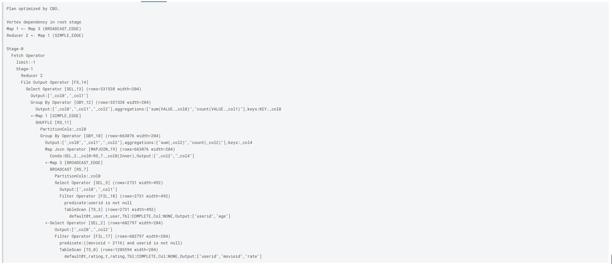

# HivePractice

## 题目一（简单）
展示电影 ID 为 2116 这部电影各年龄段的平均影评分。

HiveQL语句：

```SQL
SELECT t_user.age AS age,
       avg(t_rating.rate) AS avgrate
FROM t_rating
JOIN t_user ON t_rating.userid = t_user.userid
WHERE movieid = 2116
GROUP BY t_user.age;
```

执行结果：


语句解释：

