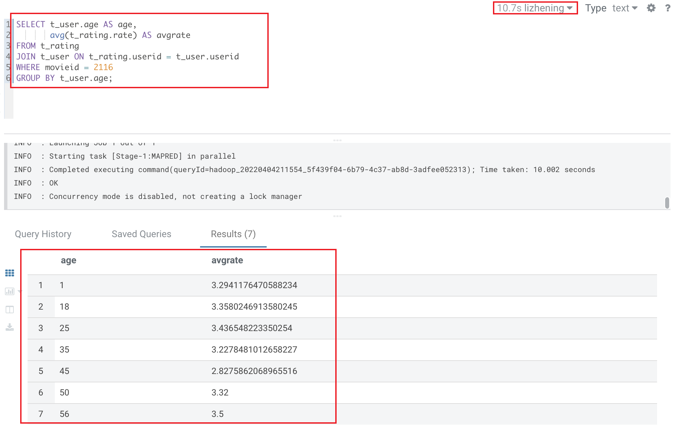
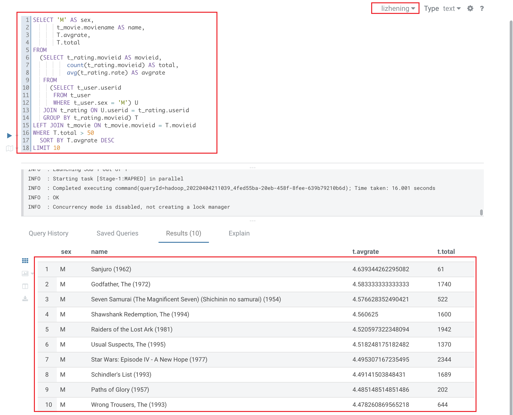

# HivePractice
## 准备工作

创建自己的数据库：
```SQL
CREATE DATABASE lizhening;
```

查看数据库是否被创建：
``` SQL
SHOW DATABASES;
```

使用刚刚创建的数据库:
```SQL
USE lizhening;
```

创建表并导入数据
```SQL
CREATE EXTERNAL TABLE lizhening.t_user(userid BIGINT, sex STRING, age INT, occupation BIGINT, zipcode BIGINT) ROW FORMAT SERDE 'org.apache.hadoop.hive.contrib.serde2.MultiDelimitSerDe' WITH SERDEPROPERTIES("field.delim"="::") STORED AS TEXTFILE LOCATION '/data/hive/users/';

CREATE EXTERNAL TABLE lizhening.t_movie(movieid BIGINT, moviename STRING, movietype STRING) ROW FORMAT SERDE 'org.apache.hadoop.hive.contrib.serde2.MultiDelimitSerDe' WITH SERDEPROPERTIES("field.delim"="::") STORED AS TEXTFILE LOCATION '/data/hive/movies/';

CREATE EXTERNAL TABLE lizhening.t_rating(userid int, movieid int, rate int, times bigint) ROW FORMAT SERDE 'org.apache.hadoop.hive.contrib.serde2.MultiDelimitSerDe' WITH SERDEPROPERTIES ("field.delim" = "::") LOCATION '/data/hive/ratings/';
```

## 题目一（简单）
展示电影 ID 为 2116 这部电影各年龄段的平均影评分。

HiveQL语句：

```SQL
SELECT t_user.age AS age,
       avg(t_rating.rate) AS avgrate
FROM t_rating
JOIN t_user ON t_rating.userid = t_user.userid
WHERE movieid = 2116
GROUP BY t_user.age;
```

执行结果：



语句解释：


 
##  题目二（中等）
找出男性评分最高且评分次数超过 50 次的 10 部电影，展示电影名，平均影评分和评分次数

HiveQL  语句：
```SQL
SELECT 'M' AS sex,
       t_movie.moviename AS name,
       T.avgrate,
       T.total
FROM
  (SELECT t_rating.movieid AS movieid,
          count(t_rating.movieid) AS total,
          avg(t_rating.rate) AS avgrate
   FROM
     (SELECT t_user.userid
      FROM t_user
      WHERE t_user.sex = 'M') U
   JOIN t_rating ON U.userid = t_rating.userid
   GROUP BY t_rating.movieid) T
LEFT JOIN t_movie ON t_movie.movieid = T.movieid
WHERE T.total > 50
  SORT BY T.avgrate DESC
LIMIT 10
```

结果展示：



## 遇到的问题
在做第二个作业时，发现结果无论怎么改，出来都是有重复的数据，开始还以为是HiveQL写的不对，改了很久。后来发现是default库中t_movie表的数据存在重复，每个id都有两条数据 ，可能是有同学将movie.dat中的数据追加append到default库中，所以导致查询出来的数据都是两条重复的。这才新建了自己的库lizhening，创建了新的三张表，用/data/hive中的数据导入进来（开头准备部分）。
    